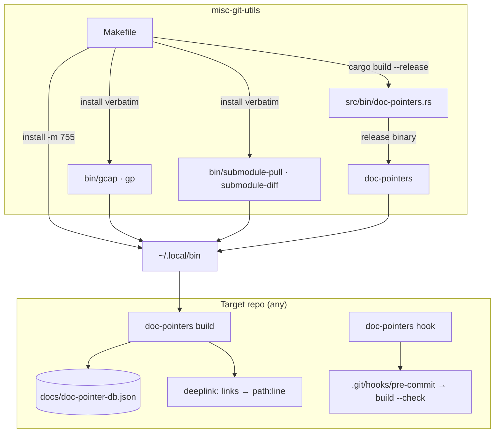

# Project Architecture — misc-git-utils

## Overview

`misc-git-utils` is a terminal utility package of miscellaneous git helper commands: four
standalone bash scripts plus one Rust binary (`doc-pointers`). Each installed command is
self-contained — there is no shared runtime library, no configuration files, and no state
of its own (the `doc-pointers` database lives in whatever *target* repo the tool is run
against, not here).

The package has two architectural halves. The bash half (`bin/`) is a set of thin,
`set -euo pipefail` wrappers around git plumbing for everyday workflows: quick
commit-and-push (`gcap`, `gp`) and submodule hygiene (`submodule-pull`,
`submodule-diff`). The Rust half (`src/bin/doc-pointers.rs`, ~1000 lines, single file) is
a durable cross-document pointer system: it mints 4-glyph Unicode tokens (Egyptian
Hieroglyphs block, U+13000–U+1342F) via deterministic UUIDv5 derivation, scans a repo for
inline `⟦token⟧ Name :: Description` declarations, maintains a JSON database
(`docs/doc-pointer-db.json` in the target repo), and rewrites `deeplink:⟦token⟧` Markdown
links into concrete `path:line` targets — so documentation anchors survive renames,
refactors, and file moves.

## System Diagram

## Core Components

| Component | Language | Purpose |
|-----------|----------|---------|
| `bin/gcap` | bash | `git commit -a -m "<msg>" && git push origin HEAD` in one command |
| `bin/gp` | bash | `git push origin HEAD` shorthand |
| `bin/submodule-pull` | bash | ff-only pull of every `.gitmodules` submodule; skips detached HEADs with a note (tag-aware) |
| `bin/submodule-diff` | bash | Recursively walks nested submodules; streams staged, unstaged, and untracked diffs with path-prefixed headers |
| `bin/doc-pointers` | bash | Dev-only `cargo run` wrapper — **not installed**; the release binary is installed instead |
| `src/bin/doc-pointers.rs` | Rust | Doc-pointer scanner/DB tool: `build` (scan + expand, `--write`/`--check`), `uuid5` (mint token), `hook` (pre-commit installer), plus legacy bare-flag dispatch |
| `Makefile` | make | `test` (cargo fmt/build + `bash -n` each script), `install` → `~/.local/bin` |

## doc-pointers Design

Tokens are 4 glyphs drawn from the Hieroglyphs block so they are visually distinct and
never occur in real source. UUIDv5 derivation (fixed namespace
`64e9408c-37a7-5f92-8893-f149cbde01c0` + name/salt) makes tokens reproducible across
machines and collision-checked against the existing DB. Declarations are only recognized
in comment contexts (`//`, `#`, `<!--`, `/*`, `*`, `--`, `;`) or on their own line, so
they cannot collide with string literals. `build` is read-only by default; `--write`
persists DB + expanded links, `--check` exits 1 on staleness (CI / pre-commit gate),
`hook` installs a pre-commit hook running the check.

## Key Decisions

- **Bash + Rust split**: trivial git wrappers stay as dependency-free bash; the pointer
  tool needs Unicode/UUID handling and a persistent DB, so it is Rust (sole crate dep:
  `uuid` v4/v5).
- **Release binary over wrapper**: `make install` installs the compiled `doc-pointers`;
  the `bin/doc-pointers` cargo-run wrapper exists only for in-tree development.
- **Identity vs location**: a pointer's identity is the token, its location is resolved
  on demand by `build` — links never rot when code moves.
- **Legacy flag compatibility**: bare `--write`/`--check`/`--install-hook` at top level
  still dispatch to the corresponding subcommands so existing scripts keep working.
- **No target-repo state here**: the pointer DB default path `docs/doc-pointer-db.json`
  is relative to the repo being scanned; this package ships no data.

## Ecosystem Fit

Lives under `utilities/shell/` in the Noizu Infra monorepo. It is wired into the
repo-wide install chain — `make install-utilities` at the repo root → `utilities/` →
`utilities/shell/Makefile` (`SUBDIRS` includes `misc-git-utils`, via shared
`mk/subdirs.mk`) → this package's `make install` — landing all commands in
`~/.local/bin` alongside the other DevOps tools. Unlike most sibling utilities, it does
**not** source `share/k8-lib` and does **not** read `.infra-config.yaml`; it is pure git
tooling with zero coupling to the k8s/deploy conventions.

## Project Layout

See [PROJ-LAYOUT.md](PROJ-LAYOUT.md) for the annotated file tree.
