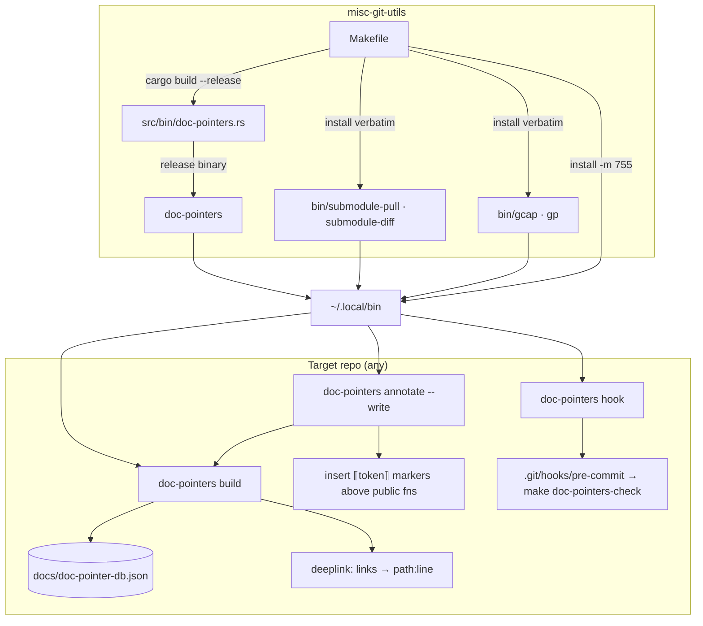

# Project Architecture — misc-git-utils

## Overview

`misc-git-utils` is a terminal utility package of miscellaneous git helper commands: four
standalone bash scripts plus one Rust binary (`doc-pointers`). Each installed command is
self-contained — there is no shared runtime library and no configuration; the only state
(the `doc-pointers` pointer database) lives in whatever *target* repo the tool is run
against, not here.

The package has two architectural halves. The bash half (`bin/`) is a set of thin,
`set -euo pipefail` wrappers around git plumbing for everyday workflows: quick
commit-and-push (`gcap`, `gp`) and submodule hygiene (`submodule-pull`,
`submodule-diff`). The Rust half (`src/bin/doc-pointers.rs`, ~2000 lines, single file)
is a durable cross-document pointer system: it mints 4-glyph Unicode sign tokens via
deterministic UUIDv5 derivation, scans a repo for inline `⟦token⟧ Name :: Description`
declarations, maintains a JSON database (`docs/doc-pointer-db.json` in the target repo),
rewrites `deeplink:⟦token⟧` Markdown links into concrete `path:line` targets, and can
auto-insert declarations above every public function — so documentation anchors survive
renames, refactors, and file moves.

## System Diagram

## Core Components

| Component | Language | Purpose |
|-----------|----------|---------|
| `bin/gcap` | bash | `git commit -a -m "<msg>" && git push origin HEAD` in one command |
| `bin/gp` | bash | `git push origin HEAD` shorthand |
| `bin/submodule-pull` | bash | ff-only pull of every `.gitmodules` submodule; skips detached HEADs with a note (tag-aware) |
| `bin/submodule-diff` | bash | Recursively walks nested submodules; streams staged, unstaged, and untracked diffs with path-prefixed headers |
| `bin/doc-pointers` | bash | Dev-only `cargo run` wrapper — **not installed**; the release binary is installed instead |
| `src/bin/doc-pointers.rs` | Rust | Doc-pointer tool with subcommands `build` (scan + deeplink expansion, `--write`/`--check`), `annotate` (auto-insert markers, dry-run by default), `uuid5` (mint token), `hook` (pre-commit installer); legacy bare-flag dispatch retained |
| `Makefile` | make | `test` (cargo fmt/build + `bash -n` each script), `install` → `~/.local/bin` |

## doc-pointers Design

**Token identity.** Tokens are 4 glyphs drawn from curated Unicode sign blocks —
Meroitic Hieroglyphs, Egyptian Hieroglyphs, Egyptian Hieroglyphs Extended-A, and
Anatolian Hieroglyphs (5,744 glyphs total; control codepoints excluded) — so they are
visually distinct and never occur in real source. UUIDv5 derivation (fixed namespace
`64e9408c-37a7-5f92-8893-f149cbde01c0` + name/salt, with retry-on-collision up to
10,000 attempts) makes tokens reproducible across machines and collision-checked
against the existing DB.

**Safe recognition.** Declarations are only recognized in comment contexts (`//`, `#`,
`<!--`, `/*`, `*`, `--`, `;`) or on their own line; a line with an odd count of
unescaped `"` before the marker is treated as a string literal and skipped, and
Markdown code fences are ignored. Scans cover a fixed suffix list while skipping build/
dependency/generated dirs and lockfiles, scoped by repeatable `--include`/`--exclude`
prefix filters.

**Write discipline.** `build` and `annotate` are read-only/dry-run by default. `--write`
persists the DB and expands links (annotate follows its insertions with a closing build
so `build --check` is green in the same run); `--check` exits 1 on any staleness — the
CI/pre-commit gate. `hook` installs a pre-commit script (marker
`# therobotdrafts-doc-pointers`, refuses to clobber unmanaged hooks) running
`make doc-pointers-check` in the target repo.

**Annotate coverage.** `annotate` targets public API only: Rust `pub fn` (plain `pub` —
`pub(crate)` deliberately excluded), Elixir `def`/`defmacro` (one marker per name
across clauses/arities), and JS/TS `export function`/`export const fn`/`exports.x`/
`module.exports.x`; `.exs` is opt-in via `--lang exs`. Existing markers in the
preceding doc block suppress re-insertion (idempotent); descriptions are derived from
the first doc-comment sentence when present.

## Key Decisions

- **Bash + Rust split**: trivial git wrappers stay as dependency-free bash; the pointer
  tool needs Unicode/UUID handling and a persistent DB, so it is Rust (sole crate dep:
  `uuid` v4/v5).
- **Release binary over wrapper**: `make install` installs the compiled `doc-pointers`;
  the `bin/doc-pointers` cargo-run wrapper exists only for in-tree development.
- **Identity vs location**: a pointer's identity is the token, its location is resolved
  on demand by `build` — links never rot when code moves.
- **Line-anchored parsing, no AST**: declaration detection is deliberately simple
  start-of-line string matching (no regex dep); it excludes string-literal false
  positives structurally, and flags `macro_rules!` / object-literal `module.exports`
  files for manual review instead of guessing.
- **Byte-exact DB gate**: the DB payload is deterministic (sorted keys, fixed indent),
  so `--check` is a plain string comparison — staleness detection needs no diff logic.
- **Legacy flag compatibility**: bare `--write`/`--check`/`--install-hook` at top level
  still dispatch to the corresponding subcommands so existing scripts keep working.
- **No target-repo state here**: the pointer DB default path `docs/doc-pointer-db.json`
  is relative to the repo being scanned; this package ships no data.

## Ecosystem Fit

Lives under `utilities/shell/` in the Noizu Infra monorepo (source dual-path
`Portfolio/Utilities/source/misc-git-utils`). It is wired into the repo-wide install
chain — `make install-utilities` at the repo root → `utilities/` → `utilities/shell/`
`Makefile` (`SUBDIRS` includes `misc-git-utils`, via shared `mk/subdirs.mk`) → this
package's `make install` — landing all commands in `~/.local/bin` alongside the other
DevOps tools. Unlike most sibling utilities, it does **not** source `share/k8-lib` and
does **not** read `.infra-config.yaml`; it is pure git tooling with zero coupling to the
k8s/deploy conventions. A cross-crate pact exists with `repo-lock`'s `glyph.rs`: the
token-encoder golden test here (`generated_token_matches_unity_fixture`) must stay in
sync with repo-lock's duplicate encoder.

## Project Layout & Schema

See [PROJ-LAYOUT.md](PROJ-LAYOUT.md) for the annotated file tree and
[PROJ-SCHEMA.md](PROJ-SCHEMA.md) for the data/grammar artifacts (DB JSON shape,
marker and deeplink grammars, CLI flags).
