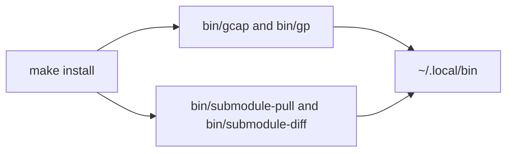

# Project Architecture — misc-git-utils

## Overview

This package installs four standalone Bash commands for Git and submodule housekeeping. Each command is a self-contained script in `bin/`; there is no shared runtime or persistent state.

```mermaid
flowchart LR
  A[make install] --> B[bin/gcap and bin/gp]
  A --> C[bin/submodule-pull and bin/submodule-diff]
  B --> D[~/.local/bin]
  C --> D
```

| Command | Behavior |
|---|---|
| `gcap` | Commit all tracked changes with the supplied message, then push `origin HEAD`. |
| `gp` | Push `origin HEAD`. |
| `submodule-pull` | Fast-forward initialized submodules; skip detached HEADs. |
| `submodule-diff` | Show staged, unstaged, and untracked changes across nested submodules. |

The doc-pointer CLI and MCP service are maintained together in [doc-pointers](https://github.com/the-robot-lives/doc-pointers). This package no longer builds or installs that CLI.
