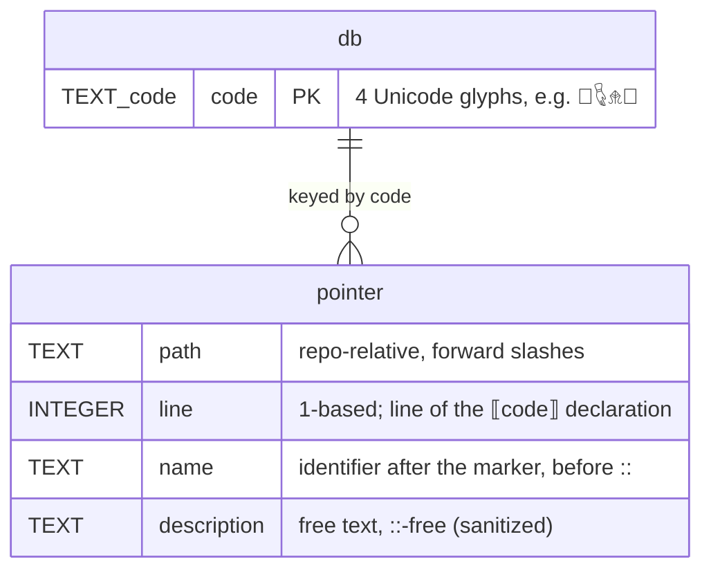

# Project Schema — misc-git-utils

## Persistence Layer: NONE (SQL)

This project has **no database and no SQL schema**. It is a collection of CLI git
helpers; nothing here provisions tables, migrations, or a datastore of its own.

What it *does* have are file artifacts it reads and writes **in whatever target
repository it is pointed at** (never inside this repo), plus well-defined CLI and
marker grammars. Those are documented below as the project's "schema" surface.

## Artifact Overview

| Artifact | Produced by | Lives in | Format |
|----------|-------------|----------|--------|
| Pointer database | `doc-pointers build --write` / `annotate --write` | `<target-repo>/docs/doc-pointer-db.json` | JSON object (deterministic, sorted) |
| Pre-commit hook | `doc-pointers hook` | `<target-repo>/.git/hooks/pre-commit` | POSIX sh script |
| Pointer declarations | authors (or `annotate --write`) | source/doc files of target repo | inline comment grammar |
| Deeplink refs | authors | Markdown files of target repo | `deeplink:` link grammar |

## Pointer Database — `docs/doc-pointer-db.json`

Single JSON object mapping 4-glyph token code → pointer record. Written by a
hand-rolled serializer (`db_payload`/`write_db` in `src/bin/doc-pointers.rs`):
keys sorted lexicographically, 2-space indent, trailing newline. Byte-exactness
matters — `build --check` compares the payload string to the file on disk and
fails on any drift.



```plantuml
@startuml
skinparam linetype ortho

TABLE(doc_pointer_db) {
  * code : TEXT(4 glyphs) <<PK>>
  --
  * path : TEXT
  * line : INTEGER
  * name : TEXT
  * description : TEXT
}
@enduml
```

### Field rules

| Field | Type | Nullable | Notes |
|-------|------|----------|-------|
| key (code) | string, exactly 4 chars from the token alphabet | No | token alphabet = Meroitic Hieroglyphs (U+10980–U+1099F), Egyptian Hieroglyphs (U+13000–U+1342F), Egyptian Hieroglyphs Extended-A (U+13460–U+143FF), Anatolian Hieroglyphs (U+14400–U+1467F); 5,744 glyphs total |
| path | string | No | relative to `--root`, `\` normalized to `/` |
| line | integer ≥ 1 | No | recomputed on every `build`; may be provisional after `annotate` until the closing build |
| name | string, non-empty | No | text between marker and `::` with comment tails stripped |
| description | string | No | may be a fallback `auto-generated pointer for public function <name>`; `::` softened to `:`, first sentence / ≤100 chars |

Duplicate codes across the tree are a scan **error** (reported; never written).

## Pre-commit Hook — `.git/hooks/pre-commit`

Installed by `doc-pointers hook` (legacy: `--install-hook`). Refuses to overwrite
an existing hook that lacks the management marker.

```sh
#!/bin/sh
# therobotdrafts-doc-pointers     ← management marker (idempotent install key)
set -eu
cd '<absolute repo root>'
make doc-pointers-check           ← expects a target of that name in the target repo
```

## Pointer Declaration Grammar

Recognized only in **comment context** or on a bare line — never inside a string
literal (odd count of unescaped `"` before the marker disqualifies the line), never
inside a Markdown code fence:

```
⟦CODE⟧ Name :: Description
```

- `CODE` — 4 glyphs from the token alphabet above (`⟦⟧/?#:%` and whitespace invalid)
- `Name` — non-empty; leading comment markers (`//`, `#`, `<!--`, `/*`, `*`, `--`, `;`) stripped
- `Description` — free text; trailing `-->`/`*/` stripped
- Scanned file types: asmdef, cs, css, ex, exs, html, js, json, md, meta, mjs, rs, shader, ts, tsx, txt, uxml, yaml, yml (minified/lock files and `deps/`, `target/`, `node_modules/`, etc. skipped)

## Deeplink Reference Grammar

In Markdown (outside code fences):

```
[label](deeplink:⟦CODE⟧)   →  expanded to  [label](path:line?code=⟦CODE⟧)
```

Unresolved codes are reported as errors and left unexpanded; bare `CODE` (no
brackets) inside a deeplink is also accepted.

## CLI Flag Grammar

```
doc-pointers                              help (exit 0)
doc-pointers build     [--root R] [--db P] [--include P]... [--exclude P]...
                       [--write] [--check] [--install-hook (legacy dispatch)]
doc-pointers annotate  [--root R] [--db P] [--include P]... [--exclude P]...
                       [--lang exs] [--write]
doc-pointers uuid5     [NAME] [--root R] [--db P] [--namespace N] [--salt S]
                       [--format marker|code|declaration|deeplink]
                       [--description TEXT] [--no-clipboard]     (alias: new)
doc-pointers hook      [--root R] [--db P]
doc-pointers help | -h | --help
```

- No arguments at all → help, exit 0
- `-h`/`--help`/`help` → help
- A leading legacy build flag (`--root`/`--db`/`--write`/`--check`/`--install-hook`) is treated as `build` (legacy scripts keep working)
- Unknown subcommand → error, exit 1

- `--root` defaults to `.`; `--db` defaults to `docs/doc-pointer-db.json` (root-relative)
- Legacy top-level `--write` / `--check` / `--install-hook` dispatch to `build` / `hook`
- `--write` and `--check` are mutually exclusive in effect: `--write` mutates, `--check` exits 1 if a mutation would be needed

## Environment & State

- No environment variables, no config files, no caches of its own.
- `uuid5` shells out to `pbcopy` (macOS) unless `--no-clipboard`.
- Only mutable state is the target-repo artifacts above.

## Project Layout

See [PROJ-LAYOUT.md](PROJ-LAYOUT.md) for the file tree; [PROJ-ARCH.md](PROJ-ARCH.md) for design rationale.
