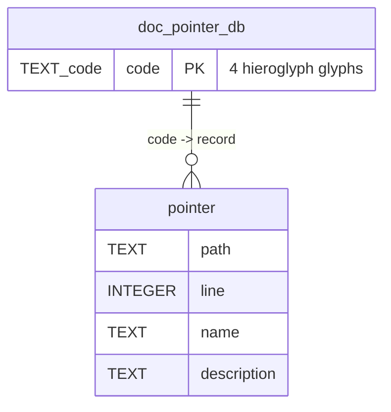

# Project Schema Summary — misc-git-utils

**No SQL/persistence layer.** CLI tool collection; all data artifacts live in the
*target repo* it is run against, not here.

| Artifact | Path (target repo) | Written by | Key shape |
|----------|--------------------|-----------|-----------|
| Pointer DB | `docs/doc-pointer-db.json` | `build --write`, `annotate --write` | `{ code: {path, line, name, description} }`, sorted, byte-exact (`--check` gate) |
| Pre-commit hook | `.git/hooks/pre-commit` | `hook` | `make doc-pointers-check`, marker `# therobotdrafts-doc-pointers` |
| Declarations | source/doc files | authors / `annotate --write` | `⟦CODE⟧ Name :: Description` in comment context only |
| Deeplinks | `*.md` | authors; expanded by `build` | `[label](deeplink:⟦CODE⟧)` → `(path:line?code=⟦CODE⟧)` |

Token alphabet: Meroitic/Egyptian/Egyptian-Ext-A/Anatolian Hieroglyphs, 5,744 glyphs; codes are 4 glyphs via UUIDv5.

No env vars, no config files, no caches.
